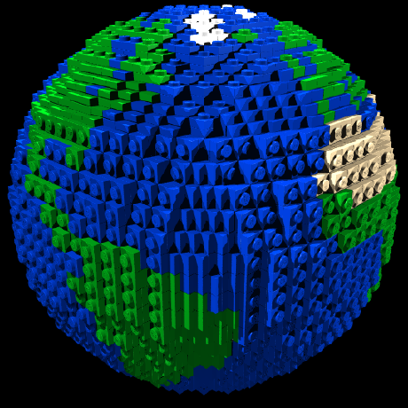
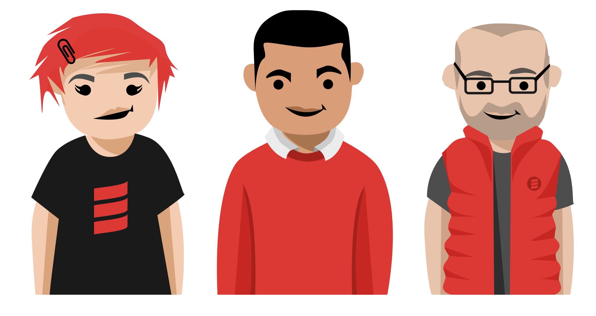
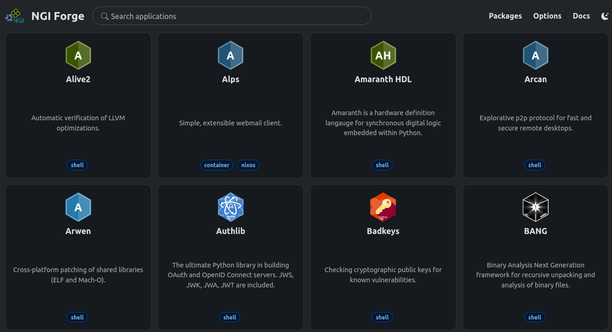
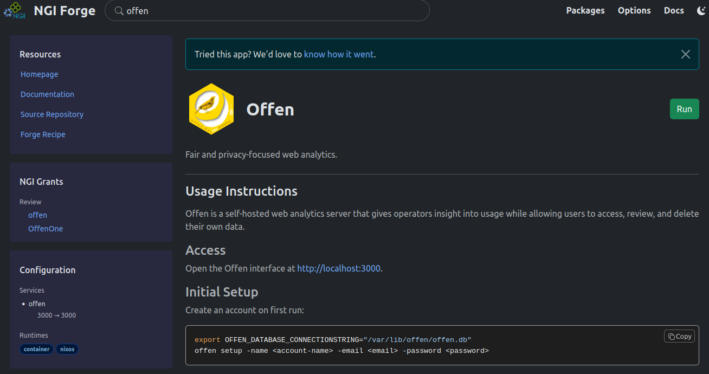
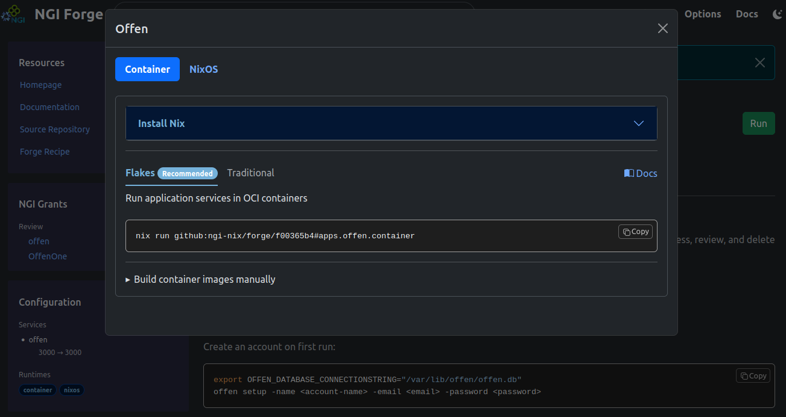
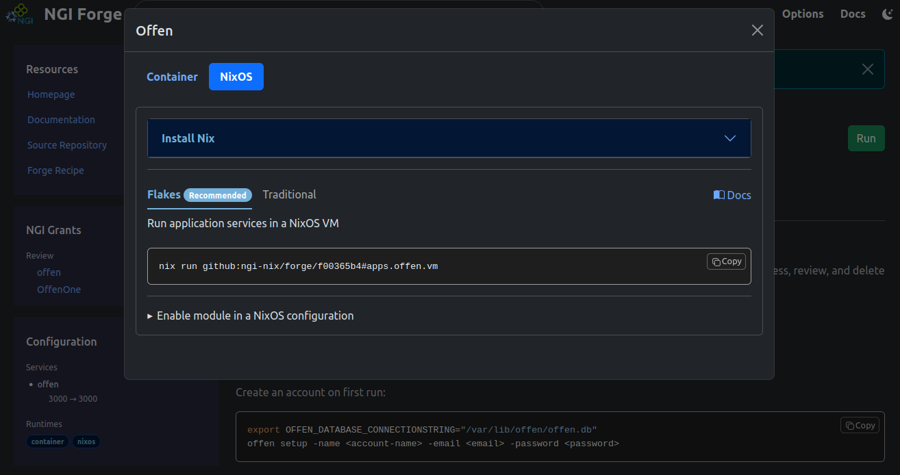
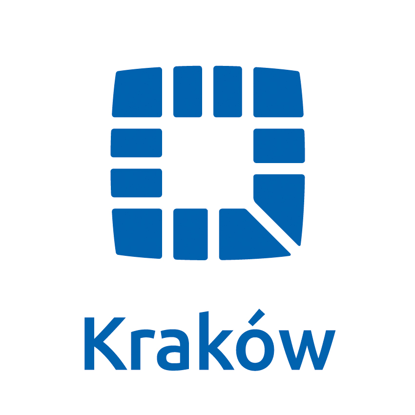

# NGI Forge
## Software Distribution Platform for NGI projects

NixCon, Kraków, Poland, 2026

**Ivan Mincik (@imincik)**,
**Daniel Ramirez (@wamirez)**,
**Fedi Jamoussi (@eljamm)**,
**Katepalli Phani Rithvij (@phanirithvi)**,
**Julien Moutinho (@ju1m)**

---

## Intro

---

### NGI (Next Generation Internet) program

**European Commission initiative** that aims to shape the development and evolution
of the Internet into an Internet of Trust.


https://www.ngi.eu/about/

---

### NGI Zero

An idea-driven **consortium of not-for-profit organisations** from across Europe.


https://www.ngi.eu/ngi-projects/ngi-zero/

---

### NixOS Foundation

NGI Zero **consortium partner**.


https://nixos.org/

---

### NLnet Foundation

NGI Zero **consortium leader**.


https://nlnet.nl/

Note:
* 1000+ funded free software projects (1800+ cascading grants)
---

### NGI Team @ NixOS Foundation

     

* "Impossible" task: **package all NGI-funded projects** with Nix

* **Summer of Nix**

https://nixos.org/community/teams/ngi/

Note:
FIXME: replace images with avatars

---

## The Problem

---

### #1
**How to package** 1000+ projects funded by 1800+ NLnet grants ?

---

### #2
**How to sustainably maintain** 1000+ projects in a future ?

---

## The Idea

---


**Distribute packaging and maintenance** effort across many contributors and power users.

---

## Goal

Build an **intuitive packaging and software distribution platform** which provides **attractive additional values** and **gradually exposes users to Nix**.

---

## NGI Forge


Note:
Forge development has started in Feb 2026

---

### Features

* **Modules system** for packaging configuration (recipe files)

* **Packages**

* **Applications**
  * CLIs, GUI programs: **program** and **shell** runtime

  * Services: **container** and **NixOS** runtime

* **Web UI**

---



## User interface

---

### NGI applications catalogue



Note:
TODO: update all screenshots

---

### Offen



---

### Run offen in container



---

### Run offen in NixOS



---

### Run offen in container

```bash
nix run github:ngi-nix/forge/f00365b4#apps.offen.container

Creating container image /home/imincik/.cache/ngi-forge/e70cdb81/offen-offen-j3g9by1lj3mk3p9yclhzpbx15y9y36rr.tar ... done.
Loaded image: localhost/offen-offen:j3g9by1lj3mk3p9yclhzpbx15y9y36rr

[offen] | [2026-09-03T09:36:59Z INFO  nimi::cli] Launching process manager...
[offen] | [2026-09-03T09:36:59Z INFO  nimi::process_manager] Starting process manager...
[offen] | [2026-09-03T09:36:59Z INFO  offen] Running: /nix/store/hglbmavg7kjvpv36yy247dzms37xk53h-offen-1.4.2-unstable-2026-06-11/bin/offen serve
```


---


## Contributor interface

---

### Applications

`recipes/apps/offen/recipe.nix`

```nix
  apps.offen = {
    # place for application configuration
  }
```
---

#### Metadata

```nix
  displayName = "Offen";
  description = "Fair and privacy-focused web analytics.";
  longDescription = ''
    Offen is a self-hosted web analytics server that gives operators insight
    into usage while allowing users to access, review, and delete their own
    data.
  '';
  usage = ''
    ...
  ''
```

---

#### Services

```nix
  services = {
    components.offen = {
      process.command = pkgs.offen;
      process.argv = [ "serve" ];
      process.environment = {
        OFFEN_SERVER_PORT = "3000";
        OFFEN_DATABASE_DIALECT = "sqlite3";
        OFFEN_DATABASE_CONNECTIONSTRING = "/var/lib/offen/offen.db";
      };
    };

    runtimes = {
      container.enable = true;
      nixos.enable = true;
    };
  };
```

Note:
Using NixOS modular services

---

#### Test

```nix
  test.services.script = ''
    curl localhost:3000 | grep "Offen Fair Web Analytics"
  '';
```

---

### Packages

`recipes/pkgs/offen/recipe.nix`

```nix
  pkgs.offen = {
    # place for package configuration
  }
```
---

#### Metadata

```nix
  version = "1.4.2-unstable-2026-06-11";
  description = "Fair and privacy-focused web analytics.";
  homePage = "https://www.offen.dev";
  mainProgram = "offen";
```

---

#### Source

```nix
  source = {
    git = "github:offen/offen/ec99082a37ffb5855bd84debfef227d41c7b403c";
    hash = "sha256-EGlqD3611sG3YTVe74H49PB8Hj1NsKYhLANg5VAQ0wg=";
  };
```

---

#### Build

```nix
  build.goPackageBuilder = {
    enable = true;
    vendorHash = "sha256-AeQa5oaOEB/50aPCRq702vMEtEctwP+jU5C6zB+3XR0=";
    ldflags = [
      "-s"
      "-w"
    ];
    modRoot = "server";
  };
```

---

#### Test

```nix
  test.script = ''
    offen --help
  '';
```

---

### Forge packages vs. Nixpkgs

CycloneDX Generator (cdxgen), Collabora Desktop, Variation Graphs, Teamtype,
Kikit, ...

```nix
  meta.teams = [ lib.teams.ngi ];
```

\> 300 packages maintained by NGI Team

Note:
* NGI software is either packaged in NGI Forge or in Nixpkgs
* Nixpkgs packages are re-exported as Forge apps

---


## Additional values for upstream developers

---

### Built-in development environment

```bash
nix develop .#pkgs.offen.env

Welcome. This environment contains all dependencies required
to build offen from source.

Grab the source code from /nix/store/agx01h4fykiwmy7p18w0a50rzpqhcg9n-source
or from the upstream repository and you are all set to start hacking.
```

```bash
cp -r --no-preserve=mode,ownership
  /nix/store/agx01h4fykiwmy7p18w0a50rzpqhcg9n-source
  src

cd src/server

go build -o offen ./cmd/offen
```

```bash
./offen demo
```
---

### WIP: Development environment for upstream repository

```bash
cd <source-code-repository>
```

```bash
nix flake init --template github:ngi-nix/forge#developer

nix develop
```

```bash
cd src/server

go build -o offen ./cmd/offen
```
---

### WIP: Run programs directly from upstream repository

```bash
nix run github:<owner>/<repo>#package
```

---

## Self-hosting

```bash
nix flake init --template github:ngi-nix/forge#provider
```

---

## How to contribute

* Matrix room
* GitHub project board

https://nixos.org/community/teams/ngi/

---

## Try yourself


https://ngi.nixos.org/

---

## Thank you

  



Note:
Krakow logo taken from https://www.krakow.pl/marka_krakowa/269753,artykul,do_pobrania.html .

